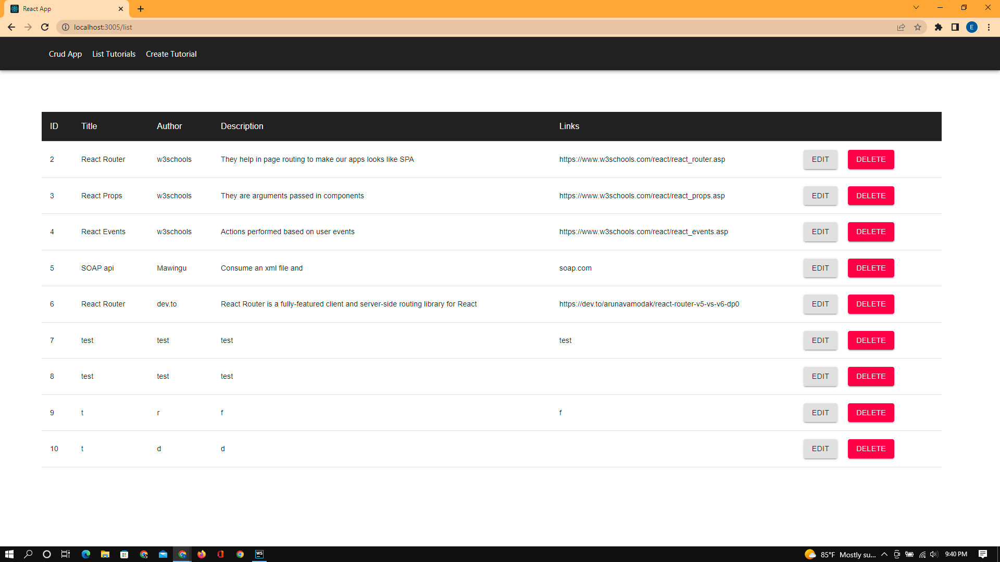

## CRUD App with Json Server
### Table of Content
- [Description](#description)
- [Features](#features)
- [Behaviour Driven Development](#Behaviour-Driven-Development)
- [Requirements](#requirements)
- [Installation Process](#installation-Process)
- [Live Link](#Live-Link)
- [Technology  Used](#technology-Used)
- [Licence](#licence)
- [Authors Info and Acknowledgment](#Authors-Info-and-Acknowledgment)
***

### [Description](#description)
React.js CRUD Application to consume Web API, display and modify data

### [Features](#features)
    Add Tutorial
    Update Tutorial
    Delete Tutorial
    View Tutorails

***
### [Behaviour Driven Development](#Behaviour-Driven-Development)

# Project setup
    clone repo 
#### In the project directory, you can run:
    npm install
     or
    yarn install

#### Compiles and hot-reloads for development
    npm start
     or
    yarn start
Open http://localhost:3000 to view it in the browser.

The page will reload if you make edits.

***
### [Technology Used](#technology-Used)
    Reactjs
    Json-server
    Axios
    Material-ui

 ****
### [Licence](#licence)

 ****
### [Authors Info and Acknowledgment](#Authors-Info-and-Acknowledgment)

* LinkedIn - [Eliud Wanja](https://www.linkedin.com/in/eliud-wanja)